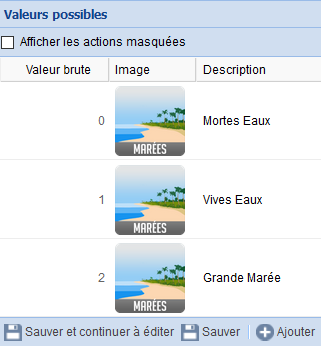

# eedomus-marees
## Description
Get tidal infos in eedomus box / informations sur les marées dans la box domotique eedomus

Ce script php permet de récupérer des informations sur les prédictions de marées pour usage avec la box domotique *eedomus*.

## Installation
1. Télécharger le projet sur GitHub : [github.com/gsn01/eedomus-marees](https://github.com/gsn01/eedomus_marees/archive/master.zip)
1. Uploader le fichier *marees.php* sur la box ([doc eedomus scripts](http://doc.eedomus.com/view/Scripts#Script_HTTP_sur_la_box_eedomus))

## Tester
Ce script peut ensuite être testé au travers du lien suivant dans le navigateur

	http://[ip_de_votre_box]/script/?exec=marees.php&port1=xx1&port2=xx2

où il faut remplacer
- *[ip_de_votre_box]* par l'IP de votre Box *eedomus*
- *xx1* par le nom du port à récuperer sur le site [horaire-maree.fr](http://horaire-maree.fr) après choix du port dans la liste
- *xx2* par le numéro du port à récuperer sur le site [maree.info](http://maree.info) après choix du port dans la liste

Exemple :	http://192.168.1.2/script/?exec=marees.php&port1=PERROS-GUIREC_TRESTRAOU&port2=66

## Résultat
Le résultat est au format XML.

Exemple de résultat
```xml
<root>
  <marees_txt>42 BM 8h23 / 21h08 PM 1h51 / 14h43</marees_txt>
  <marees_chrono>42 +1h51 -8h23 +14h43 -21h08</marees_chrono>
  <coeff_matin>42</coeff_matin>
  <maree_matin_BM>08h23</maree_matin_BM>
  <hauteur_matin_BM>3.64</hauteur_matin_BM>
  <maree_matin_PM>01h51</maree_matin_PM>
  <hauteur_matin_PM>7.11</hauteur_matin_PM>
  <coeff_apres_midi>45</coeff_apres_midi>
  <maree_apres_midi_BM>21h08</maree_apres_midi_BM>
  <hauteur_apres_midi_BM>3.69</hauteur_apres_midi_BM>
  <maree_apres_midi_PM>14h43</maree_apres_midi_PM>
  <hauteur_apres_midi_PM>7.07</hauteur_apres_midi_PM>
  <type_maree>0</type_maree>
  <sens_maree>-1</sens_maree>
  <date_grande_maree>Vendredi 08 avril 2016</date_grande_maree>
  <coeff_grande_maree>117 / 118</coeff_grande_maree>
  </root>
```

## Correspondance XPATH

Les différentes informations possibles retournées par les Xpath suivants :

- ```marees_txt``` : description texte des marées du jour (BM puis PM). *Ex : 42 BM 8h23 / 21h08 PM 1h51 / 14h43*
- ```marees_chrono``` : idem mais classé par ordre chronologique (+ => PM, - => BM). *Ex : 42 +1h51 -8h23 +14h43 -21h08*
- ```coeff_matin``` : coefficient du matin. *Ex : 42*
- ```maree_matin_BM``` : heure BM du matin. *Ex : 08h23*
- ```hauteur_matin_BM``` : hauteur BM du matin. *Ex : 3.64*
- ```maree_matin_PM``` : heure PM du matin. *Ex : 01h51*
- ```hauteur_matin_PM``` : hauteur PM du matin. *Ex : 7.11*
- ```coeff_apres_midi``` : idem pour l'après-midi
- ```maree_apres_midi_BM``` : idem pour l'après-midi
- ```hauteur_apres_midi_BM``` : idem pour l'après-midi
- ```maree_apres_midi_PM``` : idem pour l'après-midi
- ```hauteur_apres_midi_PM``` : idem pour l'après-midi
- ```type_maree``` : type de marée. *0=Mortes Eaux (<70), 1=Vives Eaux (>70), 2=Grande Marée (>100)*
- ```sens_maree``` : sens de marée. *-1=Descendante, 1=Montante*
- ```date_grande_maree``` : date de la prochaine grande marée. *Ex : Vendredi 08 avril 2016*
- ```coeff_grande_maree``` : coefficients du jour de la grande marée. *Ex>117 / 118*

## Un exemple d'exploitation avec l'eedomus

Pour le **type de marée** par exemple, créer un nouveau périphérique de type **Capteur HTTP**

Renseigner les paramètres suivants :

- Unité : ```pl.```
- Type de données : ```Liste de valeurs```
- URL de la requête : ```http://localhost/script/?exec=marees.php&port1=PERROS-GUIREC_TRESTRAOU&port2=66```
- Chemin XPATH : ```/root/type_maree```
- Fréquence de la requête : ```60```

Exemple de mise en oeuvre :


---
## Enjoy
